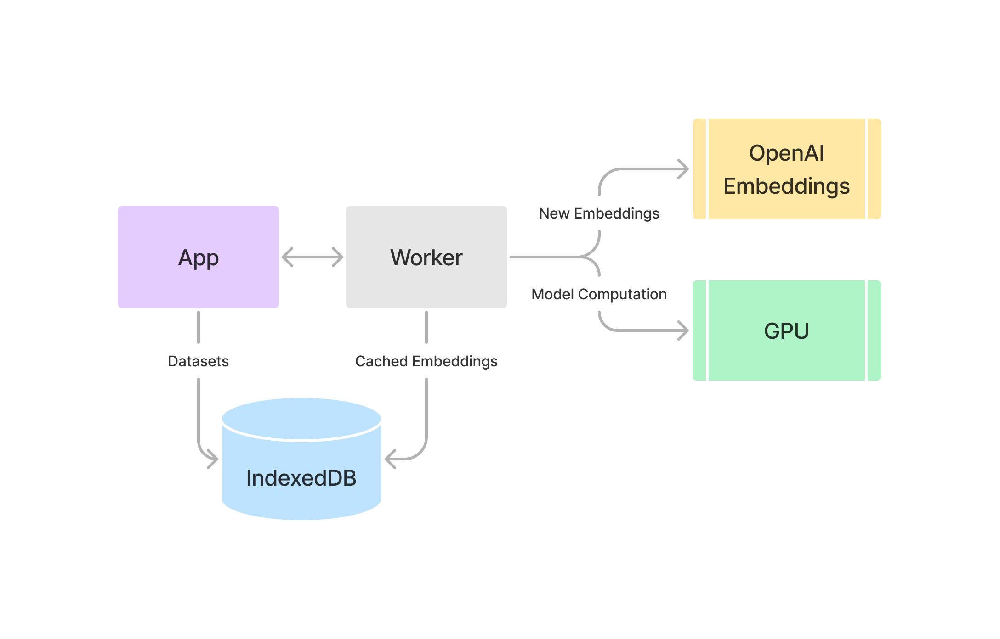

**Finetune your embeddings.**

In-browser bias matrix tuner. A standalone Tensorflow.js port of OpenAI's ["Customizing embeddings" cookbook](https://github.com/openai/openai-cookbook/blob/main/examples/Customizing_embeddings.ipynb).

Live version [here](https://a9.io/spaceshifter/).

# Installation

```
pnpm install
```

# Development

```
pnpm run dev
```

# Building

Set an appropriate [`base`](https://vitejs.dev/config/shared-options.html#base) in `vite.config.ts`.

Run:

```
pnpm run build
```

Build is outputted to `dist/`.

# Testing

Uses Vitest.

```
pnpm run test
```

# Architecture

Spaceshifter is not a typical React app. It uses Tensorflow.js in a worker to accelerate the training process on the GPU.



Most manipulation of data happens in the worker, including all of the model computation and fetching. This lets the app UI run smoothly.

User-created datasets, training parameters, and cached embeddings are all stored in an IndexedDB instance.

Important files include:

* `src/lib/model.ts`, for the model that produces the matrix
* `src/worker/TrainingWorker.ts`, for the training worker
* `src/hooks/{useTrainer,trainerState}.ts`, for a typesafe, stateful hook API to the training worker
* `src/lib/db.ts`, for the database schema