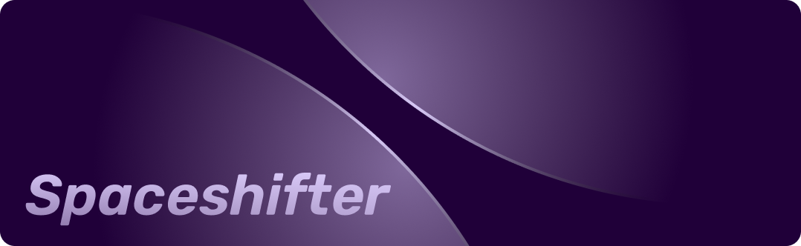

**Finetune your embeddings.**

In-browser bias matrix tuner. A standalone Tensorflow.js port of OpenAI's ["Customizing embeddings" cookbook](https://github.com/openai/openai-cookbook/blob/main/examples/Customizing_embeddings.ipynb).

Live version [here](https://a9.io/spaceshifter/).

# Installation

```
pnpm install
```

# Development

```
pnpm run dev
```
